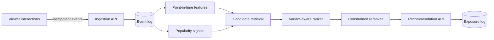

# Architecture

PulseRank's first milestone is intentionally runnable on a laptop with no external services. Its boundaries mirror the distributed design planned for later milestones.

## Correctness contracts

- Event IDs are immutable. Exact retries are safe; conflicting reuse aborts the transaction.
- Offline features only consume events at or before their requested `as_of` timestamp.
- Experiment assignments are deterministic per user and experiment.
- Exposure logging records the actual model variant, position, score, and request.
- Recently consumed titles do not return in the recommendation slate.

## Planned distributed mapping

| Local boundary | Distributed implementation |
| --- | --- |
| SQLite ingestion-order log | Redpanda Kafka topic with six partitions |
| Deterministic reference pipeline | Spark Structured Streaming with event-time watermarks |
| JSONL medallion tables | Delta Lake bronze/silver tables and checkpoints |
| In-process current features | Redis online feature store |
| Ranker module | Versioned MLflow model endpoint |
| Exposure table | Append-only experiment fact stream |

The local implementation remains a deterministic reference model for differential and replay testing after distributed components arrive.

The streaming boundary is now implemented in both forms. See [event-time streaming design](streaming.md) for schema, watermark, quarantine, checkpoint, and repair contracts.
